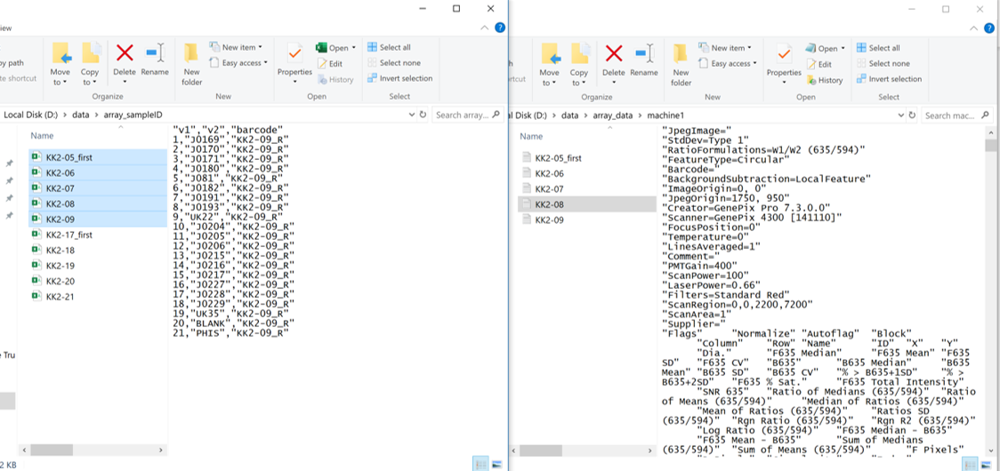
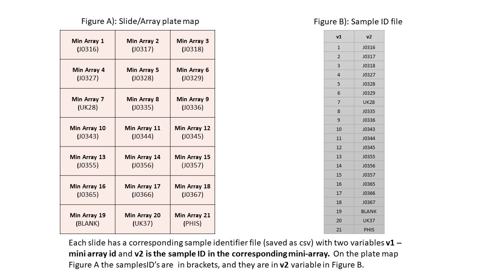

```{r setup, include=FALSE}
library(pacman)
pacman::p_load(tidyverse,ggpubr,gtools,purrr,scales,pheatmap, data.table,kableExtra,gridExtra, png,knitr ,grid,styler, pheatmap,  factoextra,FactoMineR,magick,rlang )

knitr::opts_chunk$set(echo = TRUE, message=FALSE,warning = F,
                      fig.align = 'center',#tidy = T,tidy.opts=list(arrow=TRUE, indent=2),
                      dev = "png", dev.args = list(type = "cairo-png"),
                       tidy='styler', tidy.opts=list(strict=T))


```


```{css ,echo=FALSE}
.custom-inline {
  color: red;
  font-weight: 700
}
```

## Introduction 

### General information
protGear is a package for protein micro data processing just before the main analysis. The package loads the '`gpr`' or '`txt`' file format extracted by the quantification software and merges this with the specific sample identifiers. The package processes multiple files extracted batch by batch with their corresponding sample identifier file. The sample identifier file has 2 variables '`v1`' and '`v2`' which indicate the mini-array or block number and sample identifier respectively. The '`gpr`' file and the corresponding sample identifier file have the same file name.  protGear also provides a web based $Shiny^{(R)}$ platform for real time visualization of the data processing. 

In this vignette the general work-flow of protGear will be outlined by processing a sample dataset from a multicentre study __Plasmodium falciparum__ Merozoite Protein Microarray. The multicentre study design motivated the development of the protGear suite. 

The details of the methodologies are published here https://doi.org/10.1016/j.csbj.2021.04.044

### Analysis setup
Create 2 folders that hold the '`.gpr`' files and the corresponding sample identifier files.


```{r , echo=FALSE}
img1_path <- "folder_structure.png"
#img1 <- readPNG(img1_path, native = TRUE, info = TRUE)
#include_graphics(img1_path)
 #grid.raster(img1)
```

{width=70%}


## Sample identifier file



### Installation

To install `protGear` run the following commands in R

```{r, eval=FALSE}
## make sure devtools package is installed
remotes::install_github('Keniajin/protGear', dependencies=TRUE)
```


## Importing data

```{r}
library(protGear)
```

The first part is to specify the parameters of the micro-array experiment to assist in processing the data.  The parameters specified are 

  - channel - The scanner fluorescence output used to record the data. It can be  green,red,blue among others with a specified number. 
  - chip_path - the folder where the sub folders of 'gpr' or 'txt' files are stored. This path contains sub folders with the array data, for example the sub folders for the different batches. 
  - totsamples - the number of samples in a slide or array.  
  - blockspersample - The number of blocks a sample it takes. In this example each sample occupies 2 blocks each with 384 spots. 
  - sampleID_path - the folder where the sample identifiers files are stored
  - machine - The indicator for which machine was used to hybridize the samples if the experiment had more than one machine. 
  - date_process -the date of sample processing 
  
The parameters "`chip_path`", "`channel`" , "`totsamples`" and "`sampleID_path`" are mandatory. 

```{r}
## specify the the parameters to process the data
genepix_vars <- array_vars(channel="635" ,
                           chip_path = "data/array_data",
                           totsamples = 21,
                           blockspersample = 2,
                           sampleID_path = "data/array_sampleID/",
                           mig_prefix = "_first",
                           machine =1,
                           ## optional 
                           date_process = "0520")
```


The exact channel used should be checked in the header of the file from the quantification software under `Wavelengths`. 

```{r}
header_gpr <- readLines("data/array_data/machine1/KK2-06.txt",
                        n=40)
header_gpr <- gsub("\"", "", header_gpr[1:32])
header_gpr[1:32]
```


The function  `r text_spec("check_sampleID_files()",color="red")` helps to check whether each micro array file has a corresponding sample identifier file. The sample identifier files are generated from the lab plate maps to match the corresponding samples on a specific slide.If the sample identifier file is missing, protGear automatically generates the id's. 

### Spatial structure of slide

protGear offers a functionality to inspect the slide visually for any strong spatial biases when the scan image is not available. However, we recommend using the scanned image to visualize the spatial artefacts that might not be recorded in the `.gpr` file. We include the functions `r text_spec("visualize_slide()",color="red")` and `r text_spec("visualize_slide_2d()",color="red")`  to check the spatial structure. The functions are build on `r text_spec("structure_plot()",color="red")`  which shows the block and mini-array structure of a slide. 


#### Visualize the foreground MFI 

Here we visualize the foreground MFI using the `r text_spec("visualize_slide",color="red")` function

```{r chunk6, fig.align='left'}
visualize_slide(infile='data/array_data/machine1/KK2-06.txt' ,
                MFI_var ='B635 Median' )

```

#### Visualize the background MFI  

Here we visualize  the background MFI using the `visualize_slide_2d` function

```{r chunk7, fig.align='left'}
visualize_slide_2d(infile ='data/array_data/machine1/KK2-06.txt' , 
                   MFI_var ='F635 Median' )
```


### Import .gpr/txt data

Microarray data is imported using the `r text_spec("read_array_files()",color="red")` function. The function accepts the following mandatory arguments; 

 - `filename` - the name of the file which the data are to be read from. In this example a list of multiple files from a folder is used and passed to `r text_spec("read_array_files()","red")` using `r text_spec("purrr",color="red")`. 
 - `data_path` - The path where the file with the data  is located 
 - `genepix_vars` -  A list of specific definitions of the experiment design. See  `r text_spec("array_vars()",color="red")`  

For this example I use the sub-folder 2 specified using `genepix_vars$paths[[2]]` which is this path under vignette folder `r genepix_vars$paths[[2]]`. 
 
```{r}
#### read in all the datasets
### list all the file names under data folder
filenames <- list.files(file.path(genepix_vars$paths[[2]]), 
                        pattern="*.txt$|*.gpr$", full.names=F)
#' @___________________read_in_the_files_with_the_text_data_from_the_chip_____________________________
### read all the data files and save them in a list 
data_path <- paste0(genepix_vars$paths[[2]],"/") 
data_files <- purrr::map(.x = filenames, 
                         .f = read_array_files,
                         data_path=data_path ,
                         genepix_vars=genepix_vars)
data_files <- set_names(data_files, purrr::map(filenames, name_of_files))
```


## Background Correction

Background noise is caused by non-specific fluorescence such as auto-fluorescence of the glass slide or non-specific binding of parameters and reference substances. To cut down the effect of background noise we have included different approaches for background correction. First, we extract the background values, visualize and select the best background approach. We have implemented five different approaches;
  
  1) Local background subtraction
  2) Global background subtraction
  3) Moving minimum background subtraction
  4) Normal and exponential model (normexp) 
  5) Log-linear background correction (Edwards)

In  '`.gpr`' files the Background column starts with a '`B`' followed by the wavelength or channel. In order to perform background correction, we extract the background mean fluorescent intensities (MFI's) using the function `r text_spec("extract_bg()",color="red")` . The function accepts the arguments `iden` which is the file identifier,  `data_files` a list of data objects with names utilised by `iden` and `genepix_vars` defined using  `r text_spec("array_vars()",color="red")` function. We utilise the `purr::map` function to extract the background MFI of multiple data files. 

```{r}
## utilising the map package we process a number of files  under data_files list
dfs <- names(data_files) 
allData_bg <- purrr::map(.x=dfs, .f=extract_bg,data_files=data_files,genepix_vars)
allData_bg <- set_names(allData_bg, purrr::map(filenames, name_of_files))
allData_bg <- plyr::ldply(allData_bg)
```

### Foreground vs Background

Before selecting the best background correction approach the MFI signals are be inspected visually. In protGear we first utilise the function `r text_spec("plot_FB()",color="red")` that graphs the background, _BG_Median_ and foreground values, _FBG_Median_. On the protGear Shiny platform the visuals are interactive and you can identify the features or blocks with strong bias. 

```{r}
p1 <- plot_FB(allData_bg,antigen_name="antigen",
              bg_MFI="BG_Median",FG_MFI="FBG_Median",log=F)


p1

```

### Background MFI by blocks

```{r}
p2 <- plot_bg(df=allData_bg, x_axis="Block",bg_MFI="BG_Median",
        log_mfi=T) 
p2
```

### Background correction

After background visualization and selecting the best approach the array data are merged with their specific sample identifier files. 

_`r text_spec("Note:",color="red")`_ Each array file must have its own corresponding sample identifier `.csv` file stored in `r text_spec("array_vars()",color="red")` function under `sampleID_path`. Check General information section.  


The method of background subtraction selected is specified under `r text_spec("method",color="red")` below. The background correction is performed by  `r text_spec("bg_correct()",color="red")` function.


```{r}
sample_ID_merged_dfs <- purrr::map(.x=dfs, .f=merge_sampleID ,data_files=data_files , 
                             genepix_vars, method="subtract_local")
sample_ID_merged_dfs <- set_names(sample_ID_merged_dfs, purrr::map(filenames, name_of_files))
```


## Buffer spots

Buffer spots are specific to the experiment design and are not always included. Buffer spots are used to check for unexpected scanning artefacts. The buffer spots should have similar values in  different slides. Some outliers are expected for buffer spots close sample spots or landmark. However you can specify the name of your control antigens here `r text_spec('buffer_spot="buffer"',color="blue")` if you do not have buffer spots.

```{r}
buffer_transp <- purrr::map(.x=sample_ID_merged_dfs, .f=buffer_spots ,  buffer_spot="buffer")

buffer_transp <- set_names(buffer_transp, purrr::map(filenames, name_of_files))

buffers <- plyr::ldply(buffer_transp)
plot_buffer(buffers,buffer_names="antigen",buffer_mfi="FMedianBG_correct",slide_id=".id")

```

## Coefficient of Variation (CV)

To calculate the CV's we utilise the  `r text_spec("cv_estimation()",color="red")` function with a `cv_cut_off` specified , sample identifier variable and antigen specified under `sampleID_var` and `antigen` respectively. The `replicate_var` and `mfi_var` identifies the variable with the replicate rank generated and MFI's values. 


```{r}
#' @________________________________calculated_cv_for_each_data_file_______________________________________
#' data without the selected mean for the best 2 CVs 
dataCV <- purrr::map(.x=sample_ID_merged_dfs, .f=cv_estimation ,lab_replicates=3  ,
                     cv_cut_off=20,
                     sampleID_var='sampleID', antigen_var='antigen' ,replicate_var='replicate' ,
                     mfi_var='FMedianBG_correct')

lab_replicates=3
dataCV <- set_names(dataCV, purrr::map(filenames, name_of_files))

aa <- plyr::ldply(dataCV)
GGally::ggpairs(aa,aes(color=cvCat_all) ,
        columns = paste(1:lab_replicates), title = "",  axisLabels = "show") +
  theme_light()
   
```

### Summary of CV values

Here we create a summary of the CV values for each sample/slide utilising the `r text_spec("cv_by_sample_estimation()",color="red")` function.  This helps to identify samples with high values of CV. On the protGear dashboard an interactive table is created to show the summary for each sample. 

```{r}


#' @________________________________summary_of_cv_for_each_sample________________________________________ 
#' creates summaries by cv's greater than 20 and less than 20

cv_cut_off <- 20
dataCV_sample <- purrr::map(.x=dataCV, .f=protGear::cv_by_sample_estimation , cv_variable="cvCat_all",
                            lab_replicates=3)
dataCV_sample <- set_names(dataCV_sample, purrr::map(filenames, name_of_files))
all_cv_sample <- plyr::ldply(dataCV_sample)

```


```{r}
less_20 <- rlang::sym(paste0("CV <= ",cv_cut_off, "_perc"))
gt_20 <- rlang::sym(paste0("CV > ",cv_cut_off, "_perc"))

less_20_per <-  rlang::sym(paste0("% CV <=",cv_cut_off))
gt_20_per <-  rlang::sym(paste0("% CV >",cv_cut_off))
ggplot(all_cv_sample)+
  geom_violin(aes(.id,`CV <= 20_perc`, color="% CV =<20")) +
  geom_violin(aes(.id,`CV > 20_perc`, color="% CV >20")) +
  geom_violin(aes(.id,Others_perc,color="Others")) +
  ylab("% of CV") +
  theme_minimal() +
  ggtitle("% of CV >20 or <=20 for each slide all repeats considered") 
```


### Best replicates

We have implemented a function `r text_spec("best_CV_estimation()",color="red")` to select the best replicates if an experiment has more than 2 technical replicates. This helps to select the less variable replicates.

```{r}
#' @________________________________data_with_selected_best_2_CV_______________________________________ 
#' data with the selected mean for the best 2 CVs
dataCV_best2 <- purrr::map(.x=dataCV, .f=best_CV_estimation , slide_id="iden",lab_replicates=3,
                           cv_cut_off=20)

## give the names to the returned list
dataCV_best2 <- set_names(dataCV_best2, purrr::map(filenames, name_of_files))


dataCV_sample_best2 <- purrr::map(.x=dataCV_best2, .f=cv_by_sample_estimation , 
                                  cv_variable="best_CV_cat",lab_replicates=3)
dataCV_sample_best2 <- set_names(dataCV_sample_best2, purrr::map(filenames, name_of_files))
all_cv_sample_best2 <- plyr::ldply(dataCV_sample_best2)
```


On the violin below we observe that with selecting the less variable replicates , the percentage of the "good CV" values increases.

```{r}
## plot only the CV perccentages
ggplot(all_cv_sample_best2)+
  geom_violin(aes(.id,`CV <= 20_perc`, color="% CV =<20")) +
  geom_violin(aes(.id,`CV > 20_perc`, color="% CV >20")) +
  geom_violin(aes(.id,Others_perc,color="Others")) +
  ylab("% of CV") +
  theme_minimal() +
  ggtitle("% of CV >20 or <=20 for each slide") 
```


## Tag subtraction

Tag subtraction is applied for antigens containing purification tags. A file with the specific TAG name for each antigen is loaded. The file has the `antigen,TAG and TAG_name` and the TAG_name must be part of the antigens listed.

```{r}
tag_file <- read.csv("TAG_antigens.csv")
tag_antigens <- c("CD4TAG" , "GST", "MBP")
batch_vars <- list(machine="m1", day="0520")
```


### Overview of the TAG file

```{r}
tb1 <- data.frame(head(tag_file, n=10))
tb1 %>% 
  kable() %>%
  kable_styling()
```


### Subtracting the TAG values

The function `r text_spec("tag_subtract()",color="red")` implements the TAG subtration by matching the TAG names with the corresponding TAG values. 

```{r}
#' @________________________________subtract_the_tag_values_______________________________________ 
#'
## tag subtract 
## read in the KILCHip TAG file to substract GST-1, MBP -2 and  CD4TAG - 0 file 
dataCV_tag <- purrr::map(.x=dataCV_best2, .f=tag_subtract , 
                         tag_antigens=tag_antigens, mean_best_CV_var="mean_best_CV",tag_file=tag_file,
                         antigen_var='antigen',
                         batch_vars=batch_vars)
dataCV_tag <- set_names(dataCV_tag, purrr::map(filenames, name_of_files))
dataCV_tag <- plyr::ldply(dataCV_tag)
```


In this example here we plot a graph of antigens Tagged with GST before and after TAG subtraction.

```{r}
aaa <- dataCV_tag %>% 
  filter(TAG_name=="GST") 

aaa <- aaa %>% 
dplyr::select(.id,sampleID,antigen,mean_best_CV,mean_best_CV_tag)

aaa <- aaa %>% 
  gather(measure,mfi,-c(.id:antigen))

ggplot(aaa,aes(as.factor(antigen),mfi,color=measure))  +
  geom_boxplot(aes(fill=measure),alpha=0.5)+
  theme_light() +
  xlab("antigen name")+
  ggtitle("Before and after TAG subtraction") +
  theme(axis.text.x = element_text(angle = 45, hjust = 1))
```


## Normalisation

To normalise the data, we create a matrix `matrix_antigen` with all the data combined. We ensure the slide identifier is included as row names of the matrix or we have a way to join them after normalisation. The `array_matrix` matrix is used to hold these parameters. In place of `AMA1` in the example below you use one of your features or antigen. We have implemented  four different normalisation techniques;

1) $Log_2$ normalisation
2) Loess normalisation
3) RLM normalisation
4) VSN normalisation. 


```{r}
df_to_normalise <-  dataCV_tag  %>%  ungroup() %>%  
  select(slide=.id,sampleID,sample_array_ID,antigen,mean_best_CV) %>%  
  group_by(sampleID, slide)
df_to_normalise$sample_index <- group_indices(.data =df_to_normalise )

### 
to_normalise <- df_to_normalise %>%
 ungroup() %>% select(-slide,-sampleID,-sample_array_ID) %>% 
  select(antigen, sample_index, everything()) %>%  
  gather(variable, value, -(antigen:sample_index)) %>%
  unite(temp, antigen ) %>% select(-variable) %>%
  spread(temp, value) %>% 
  as.data.frame(.)

### get the row names of the machine data
row.names(to_normalise) <- to_normalise$sample_index
#batch_all <- as.factor(paste0(to_normalise$machine,"/",to_normalise$day))
#machines <- as.factor(to_normalise$machine)
#day_batches <- as.factor(to_normalise$day)

## create the matrix to normalise
matrix_antigen <-  to_normalise %>% 
  select(-sample_index) %>% 
  as.matrix(.)


## create the matrix to hold the important parameters 
## in place of AMA1 you use one of your features or antigen
array_matrix <- df_to_normalise %>% 
  filter(antigen=="AMA1") %>% 
  ungroup() %>% 
  select(sample_array_ID,sample_index,slide)

control_antigens <- c("CommercialHumanIgG","CD4TAG")

```


The `r text_spec("matrix_normalise()",color="red")`  function is used to normalise the data and returns a list of plots and a matrix of normalised values. A plot is returned if ` return_plot = T` otherwise only a matrix of normalised values will be returned. 

```{r}
normlise_df <- matrix_normalise(matrix_antigen, method = "vsn", array_matrix=array_matrix,
                       return_plot = T,control_antigens=control_antigens)

normlise_df$plot_normalisation

```


### Compare normalisation methods

On the dashboard we compare the different normalisation techniques using the `r text_spec("mutiple_plot()",color="red")` function after loading the data.


```{r}
control_antigens <- c("CommercialHumanIgG","CD4TAG")
## no normalisation
normalise_list_none <- matrix_normalise(matrix_antigen=matrix_antigen, 
                                         method = "none", 
                                         array_matrix=array_matrix,
                                         return_plot = T,
                                         control_antigens=control_antigens)
  names(normalise_list_none) <- c("matrix_antigen_none" ,"plot_none")
## log2 normalisation
  normalise_list_log <- matrix_normalise(matrix_antigen=matrix_antigen, 
                                           method = "log2", 
                                           array_matrix=array_matrix,
                                           return_plot = T,
                                           control_antigens=control_antigens)
  names(normalise_list_log) <- c("matrix_antigen_log" ,"plot_log")
## vsn normalisation
   normalise_list_vsn <- matrix_normalise(matrix_antigen=matrix_antigen, 
                                           method = "vsn", 
                                           array_matrix=array_matrix,
                                           return_plot = T,
                                           control_antigens=control_antigens)
    names(normalise_list_vsn) <- c("matrix_antigen_vsn" ,"plot_vsn")
  ## cyclic loess with log
     normalise_list_cyclic_loess_log <- matrix_normalise(matrix_antigen=matrix_antigen, 
                                                        method = "cyclic_loess_log", 
                                                        array_matrix=array_matrix,
                                                        return_plot = T,
                                                        control_antigens=control_antigens)
    names(normalise_list_cyclic_loess_log) <- c("matrix_antigen_cyclic_loess_log" ,
                                                "plot_cyclic_loess_log")
    

     normalise_list_rlm <- matrix_normalise(matrix_antigen=matrix_antigen, 
                                                  method = "rlm", 
                                                  array_matrix=array_matrix,
                                                  return_plot = T,
                                                  control_antigens=control_antigens)
    names(normalise_list_rlm) <- c("matrix_antigen_rlm" ,"plot_rlm")
    
  
    ## create a list after normalisation
 normalised_list <- c(normalise_list_none , 
                      normalise_list_log,
                      normalise_list_vsn,
                      normalise_list_cyclic_loess_log,
                      normalise_list_rlm)
  ##
 normalised_list_plot <- normalised_list[grepl("plot",names(normalised_list))]

  
```

```{r, fig.align='center', fig.width=12, fig.height=15}
p <- do.call("grid.arrange", c(normalised_list_plot, ncol=2))
```


## Heatmaps

```{r}
norm_df <- normlise_df$matrix_antigen_normalised
norm_df <- norm_df %>% 
  select(-control_antigens)
p3 <- pheatmap::pheatmap(norm_df ,scale = "none", cluster_rows = F,
                            main=paste('VSN',"Normalised Data"),
                            silent = T)
p3 <- ggplotify::as.ggplot(p3)
p <- p3 +  theme_void()
ggsave(p ,
         filename ="heatmap.PNG" ,
         width = 16 , height = 12 , 
         limitsize = F,
         dpi=200 )
```


```{r image_heat, echo=FALSE, fig.cap="PCA analysis", out.width = '100%'}

files <- list.files(pattern = 'heatmap')

#knitr::include_graphics(files[[1]])
knitr::include_graphics('heatmap.PNG')
```

## PCA analysis

```{r pca, , fig.align='center',fig.width=16,fig.height=12}
norm_df <- normlise_df$matrix_antigen_normalised
res_pca <- prcomp( norm_df, scale = TRUE)
var <- get_pca_var(res_pca)
vars_visualise=20
#Visualize the PCA
## individuals contributing to the PCA
p1 <- fviz_pca_ind(res_pca,
                    col.var = "contrib", # Color by contributions to the PC
                    gradient.cols = c("#00AFBB", "#E7B800", "#FC4E07"),
                    repel = TRUE     # Avoid text overlapping
  )+    theme_minimal()
  
# Select the top vars_visualise contributing variables
p2 <-fviz_pca_biplot(res_pca, label="var",
                    select.var = list(contrib = vars_visualise)) +
    theme_minimal()
  
  
# Total cos2 of variables on Dim.1 and Dim.2
p3 <-     fviz_cos2(res_pca, choice = "var", axes = 1:2 , top = vars_visualise)

  
# Color by cos2 values: quality on the factor map
p4 <-  fviz_pca_var(res_pca, col.var = "cos2",
               gradient.cols = c("#00AFBB", "#E7B800", "#FC4E07"),
               select.var = list(contrib = vars_visualise),
               repel = TRUE # Avoid text overlapping
  )

 
## combine the plots into one grid
## combine the plots into one grid
## combine the plots into one grid
p_pca <- gridExtra::grid.arrange(p1,p2,p3,p4, ncol=2 )

ggsave(p_pca ,
         filename ="p_pca.PNG" ,
         width = 16 , height = 12 , 
          units = "in",
         limitsize = F,
         dpi=300)
 
```


```{r image_pca, echo=FALSE, fig.cap="PCA analysis", out.width = '100%'}
files <- list.files(pattern = 'p_pca')
#knitr::include_graphics(files[[1]])
#knitr::include_graphics('p_pca.PNG')
```


## Shiny application
Shiny is an R package that makes it easy to build interactive web apps straight from R. protGear has a built in user-friendly Shiny dashboard to assist in real-time processing and visualization. It provides five sequential steps for handling a data table of fluorescent intensities. 
The dashboard is launched as below from R or RStudio. To Install R: Open an internet browser and go to www.r-project.org.

```{r, eval=F}
protGear::launch_protGear_interactive()
```

